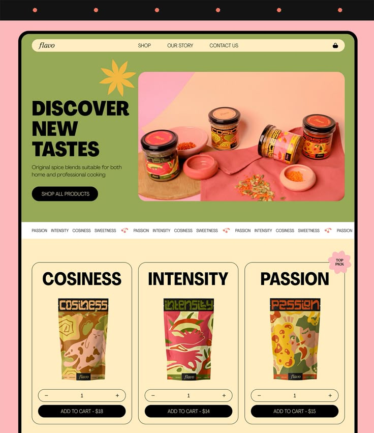

# Spice Design 🌶️  
A modern spice-themed web design inspired by Pinterest.  

## Features  
- 🍂 Colorful and attractive layout  
- 🌶️ Fully responsive design  
- 🎨 Styled using pure CSS  

## How to Use  
Simply open `index.html` in a browser to view the design.

## Technologies Used  
- HTML  
- CSS  

## Preview  
  

## Author  
Designed and coded by [Ghersi-Meriem](https://github.com/Ghersi-Meriem).  

